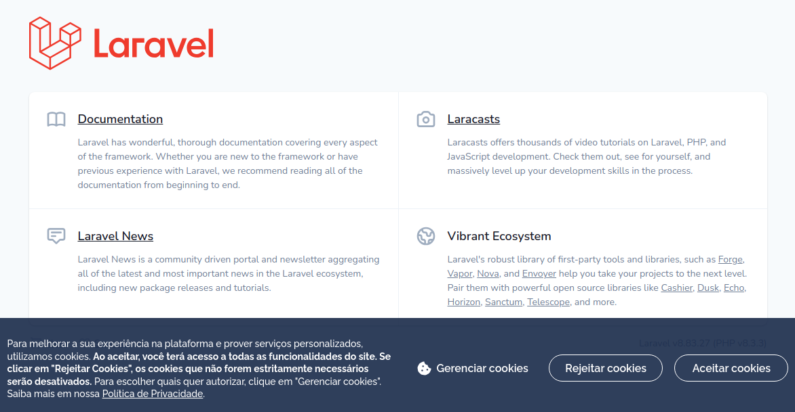
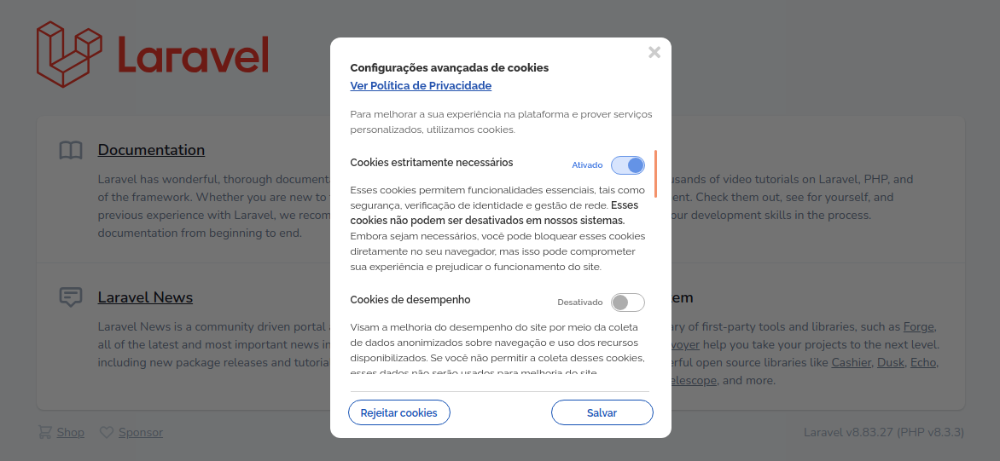

# Cookiebar

Esta cookiebar foi adaptada do Padrão Digital de Governo para ser utilizada no Laravel 8 ou superior.

<br>

### Instalação

```
composer require ifc/cookiebar
```
<br>

### Configurar url da página da Politica de Privacidade

No arquivo .env insira a url da página com a política de privacidade do site:


```
PAGINA_POLITICA_PRIVACIDADE="https://protecaodedados.ifc.edu.br/politica-de-privacidade"
```

<br>


### Alteração de textos 

Em seu projeto, utilize o arquivo criado na pasta ```./public/js/configuracoes_cookiebar_govbr.json``` para modificar o html dos textos da Cookiebar e do pop-up **Configurações avançadas de cookies**.





<br>

### Criar botão para redefinir Cookies

Em um novo botão, utilize a função **_redefinirCookies()** para abrir a janela de redefinição de cookies após eles já terem sido confirmados, exemplo:

```html
<button onclick="_redefinirCookies(); return false;">
    Redefinir Coookies
</button>
``` 

<br>

### Padrão Digital de Governo

Para mais informações sobre o Padrão Digital de Governo acesse https://www.gov.br/ds/home. 

<br>

### Licença

O Padrão Digital de Governo utiliza as licenças [CC0 1.0 Universal ](https://creativecommons.org/publicdomain/zero/1.0/) e [MIT](https://mit-license.org/).